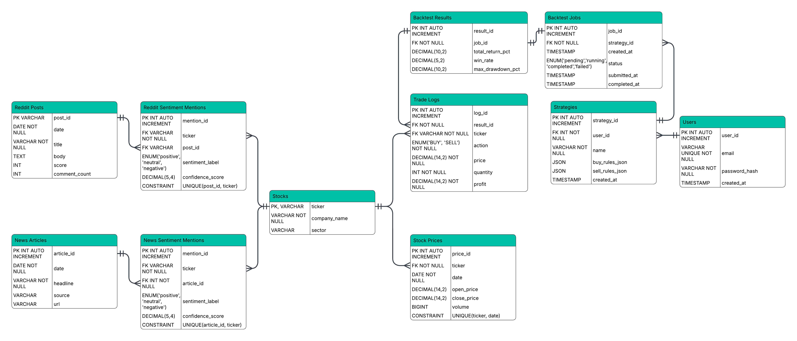

# Market Sentiment Trader https://trader.blakesmithdev.com
A Full-Stack Sentiment Analysis & Trading Simulation Platform 

## 🎯 Goal

The goal of SentimentTrader is to democratize algorithmic trading by allowing users to build, test, and compete with strategies driven by alternative data. Instead of relying solely on technical indicators, users can simulate trading performance based on News Sentiment and Reddit Hype scores derived from historical 2021 data.

## 🚀 Key Interactions

### 1. Market Dashboard

- View simulated "real-time" stock data.

- Monitor daily price changes alongside Reddit Hype and News Sentiment meters for each stock.

- Navigate through historical market dates to analyze sentiment trends over time.

### 2. Strategy Builder

- Create custom trading strategies using a logic-based rules engine.

- Set specific parameters such as Buy Thresholds (e.g., Reddit Score > 0.8), Stop Loss %, Take Profit %, and portfolio allocation limits.

### 3. Backtesting Engine

- Run asynchronous simulations on historical data to validate strategy performance without risking real capital.

- View detailed performance cards showing Total Return, Win Rate, Max Drawdown, and trade volume.

### 4. Competitive Leaderboard

- Rank your best-performing strategies against the community.

- View the top strategies sorted by Total Return %, highlighting the most successful algorithm on the platform.

## ER Diagram
[]

## 💻 Source Code

### Backend (FastAPI & Python):

- RESTful API with OAuth2 Authentication (JWT)

- SQLAlchemy ORM with PostgreSQL

- Asynchronous Background Tasks for Backtest Execution

### Frontend (SvelteKit & TailwindCSS):

- Reactive UI with Svelte 5 ($state, $derived)

- Server-side data loading

- Interactive Data Visualization

## Installation

```
    # Clone the repository
    git clone [https://github.com/yourusername/sentiment-trader.git](https://github.com/yourusername/sentiment-trader.git)

    # Backend Setup
    cd backend
    pip install -r requirements.txt
    uvicorn main:app --reload

    # Frontend Setup
    cd frontend
    npm install
    npm run dev
```
